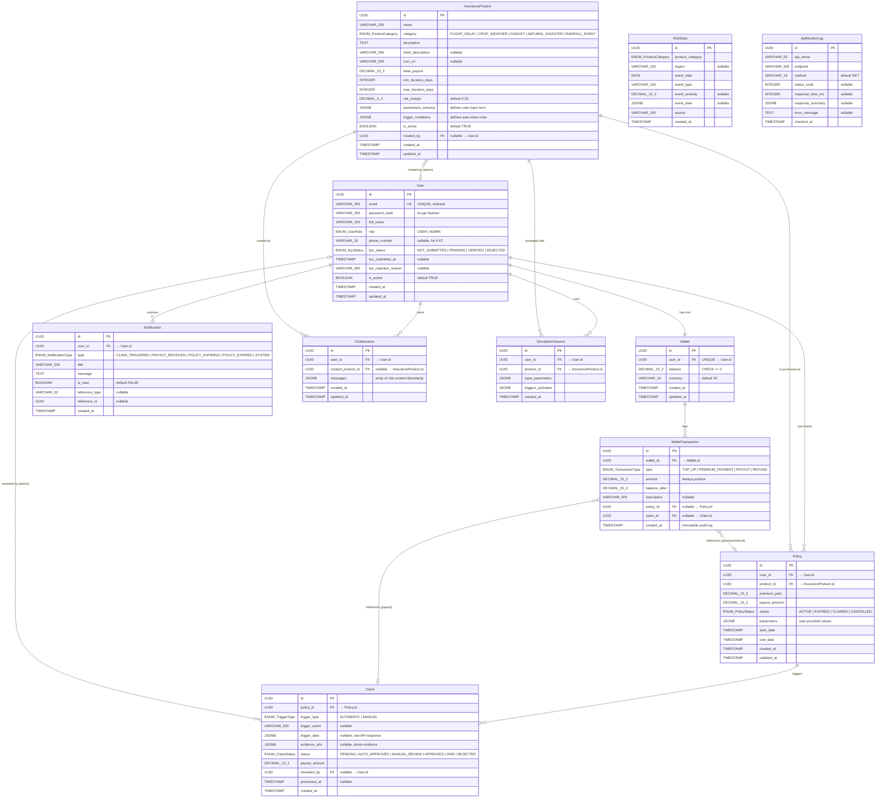

# Entity Relationship Diagram — Insurance Simulator

> Auto-generated from SQLAlchemy models (Slice 1). Matches SPEC Section 6.2.

## ERD (Mermaid)

## Relationship Summary

| From | To | Cardinality | FK Column | Notes |
|------|----|-------------|-----------|-------|
| User | Wallet | 1:1 | `wallets.user_id` | UNIQUE constraint, one wallet per user |
| User | Policy | 1:N | `policies.user_id` | User purchases many policies |
| User | Notification | 1:N | `notifications.user_id` | |
| User | ChatSession | 1:N | `chat_sessions.user_id` | |
| User | SimulationSession | 1:N | `simulation_sessions.user_id` | |
| User | InsuranceProduct | 1:N | `insurance_products.created_by` | Admin creates products (nullable) |
| User | Claim | 1:N | `claims.reviewed_by` | Admin reviews claims (nullable) |
| Wallet | WalletTransaction | 1:N | `wallet_transactions.wallet_id` | Immutable audit log |
| InsuranceProduct | Policy | 1:N | `policies.product_id` | |
| InsuranceProduct | ChatSession | 1:N | `chat_sessions.context_product_id` | Optional context |
| InsuranceProduct | SimulationSession | 1:N | `simulation_sessions.product_id` | |
| Policy | Claim | 1:N | `claims.policy_id` | |
| Policy | WalletTransaction | 1:N | `wallet_transactions.policy_id` | PREMIUM_PAYMENT, REFUND |
| Claim | WalletTransaction | 1:N | `wallet_transactions.claim_id` | PAYOUT |
| RiskData | *(logical)* InsuranceProduct | via `product_category` | No FK | Linked by enum category value |
| ApiMonitorLog | — | Standalone | — | No foreign keys |

## Indexes

| Table | Index Name | Columns | Purpose |
|-------|-----------|---------|---------|
| users | ix_users_email | `email` | Login lookups |
| insurance_products | ix_insurance_products_category_active | `category, is_active` | Catalog browsing |
| policies | ix_policies_user_status | `user_id, status` | "My active policies" |
| policies | ix_policies_status_end_date | `status, end_date` | Expiry background job |
| policies | ix_policies_product_id | `product_id` | Admin analytics |
| claims | ix_claims_status | `status` | Admin claims queue |
| wallet_transactions | ix_wallet_transactions_wallet_created | `wallet_id, created_at` | Transaction history |
| risk_data | ix_risk_data_category_region_date | `product_category, region, event_date` | Probability calcs |
| risk_data | ix_risk_data_category_date | `product_category, event_date` | Time-series queries |
| notifications | ix_notifications_user_read_created | `user_id, is_read, created_at` | Unread-first listing |
| api_monitor_logs | ix_api_monitor_logs_name_checked | `api_name, checked_at` | Recent health per API |

## Enum Definitions

| Enum | Values |
|------|--------|
| **UserRole** | `USER`, `ADMIN` |
| **KycStatus** | `NOT_SUBMITTED`, `PENDING`, `VERIFIED`, `REJECTED` |
| **TransactionType** | `TOP_UP`, `PREMIUM_PAYMENT`, `PAYOUT`, `REFUND` |
| **ProductCategory** | `FLIGHT_DELAY`, `CROP_WEATHER`, `GADGET`, `NATURAL_DISASTER`, `RAINFALL_EVENT` |
| **PolicyStatus** | `ACTIVE`, `EXPIRED`, `CLAIMED`, `CANCELLED` |
| **TriggerType** | `AUTOMATIC`, `MANUAL` |
| **ClaimStatus** | `PENDING`, `AUTO_APPROVED`, `MANUAL_REVIEW`, `APPROVED`, `PAID`, `REJECTED` |
| **NotificationType** | `CLAIM_TRIGGERED`, `PAYOUT_RECEIVED`, `POLICY_EXPIRING`, `POLICY_EXPIRED`, `SYSTEM` |

## Constraints

| Table | Constraint | Type | Rule |
|-------|-----------|------|------|
| wallets | `ck_wallet_balance_non_negative` | CHECK | `balance >= 0` |
| wallets | `user_id` | UNIQUE | One wallet per user |
| users | `email` | UNIQUE | No duplicate accounts |
| wallet_transactions | — | Append-only by convention | Never delete transactions |
